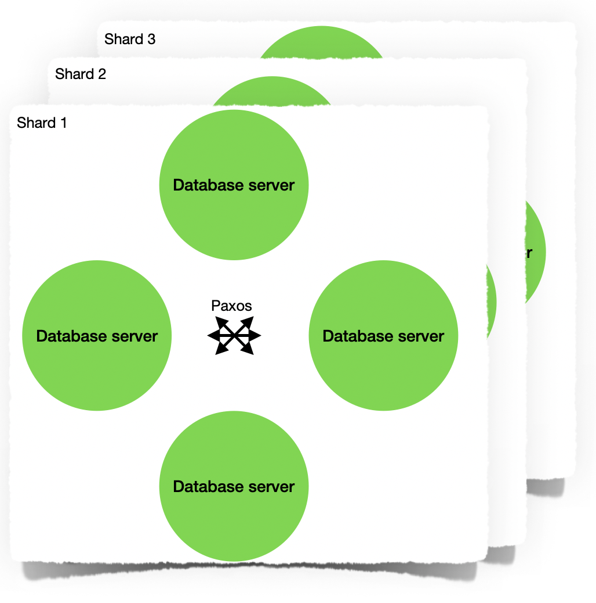

class: center, middle

# OPA

Approaching web development through:

- compilation
- static analysis
- distributed programming


---
class: center, middle

David Teller, MLState, Head of the R&D Team

(currently Mozilla, Project Fission)

** (*) ** Not everything made it to production.

---

# Web Applications


.center[
  
]

---

# ...as multi-tier systems

.center[
  
]

---

# ...as distributed systems

.center[
  
]

---
class: middle

- Ok, so it's a distributed system.
- What problems are we trying to solve?

---

# Safety

- Avoiding/recovering from web server crashes.
- Avoiding/recovering from database server crashes.
- APIs that looks safe-by-design should be safe-by-design.

---

# Security

- Avoiding SQL/XSS/shell/... injections.
- Avoiding accidental/forgotten entry points.
- Resisting malicious/ill-formed payloads.
- Sandboxing users's credentials.

---

# Privacy

- Keeping client-private data away from other clients.
- Keeping server-private data away from the clients.
- Keeping communications encrypted.

---
class: center, middle
# Let's talk programming language!

---

# Coding in OPA

```jsx
database int /counter = 0;
client function reaction(number) {
  #msg = <div>Thank you, user number {number}!</div>
}
public function action(_) {
  /counter++;
  reaction(/counter)
}
client function page() {
  <>
    <h1 id="msg">Hello</h1>
    <a class="btn" onclick={action}>Click me</a>
  </>
}
Server.start(
  Server.https("certificate.conf"),
  { ~page, title: "Database demo!" }
)
```
--

So what?

---

# Strong, static typing

```jsx
database int /counter = 0;
client function reaction(number) {
  #msg = <div>Thank you, user number {number}!</div> // Typed DSL
  // number:   anything that can be converted to string.
  // {number}: string (sanitized).
}
client function page() {
  <>
    <h1 id="msg">Hello</h1>                          // Typed DSL
    <a class="btn" onclick={action}>Click me</a>     // Typed DSL
  </>
  // a.class:    string
  // a.onclick:  event -> ()
}
```
--

- Strong, static typing avoids injections.
- XML schemas *are* static types.
- Database schemas *are* static types.
- Also, usual FP types.

---

# Web client/server distribution

```js
// Client, accessible by server
client function reaction(number) {
  #msg = <div>Thank you, user number {number}!</div>
}
// Server, accessible *by existing client*
public function action(_) {
  /counter++         // Probably a problem in production
  reaction(number)   // Message the client
}
// Client, accessible by server
client function page() {
  <h1 id="msg">Hello</h1>
  <a class="btn" onclick={action}>Click me</a>
  // Message the server  ^^^^^^^^
}
```
--

- Messages are statically typed.
- ...but not trusted.
- ...private types cannot cross boundaries.

---

# Database client/database server distribution

```js
// Shared by database client and database server.
database int /counter = 0;

public function action(_) { // That's on the web server.
  /counter++                // That's on the db server.
  reaction(/counter)        // ...and that's a bit of both.
  // The syntax hides async `db client -> db server -> db client`
  // conversations.
}
```

- Database access is always strongly-typed.
- Language is async-by-design (call/cc).
- One transaction per web call.

---

# Distribution between web servers

- Erlang-style "let it crash" error model.
- Static analysis/language design/API design guarantee that all state lives on the database or the client (*).
- Adding web servers just works (*).
- Recovering from crashes just works (*).

---

# Db peers distribution

.center[
  
]

---
class: center, middle

# Conclusions

---
# Results

- Implemented in OCaml.
- Huge strides in safety, security, privacy.
- Scalability remained a `*`.
--

- Did I mention proofs in Coq?

---

# Now, what?


- Opalang 1.0 was released.

--
- MLstate and the project died shortly after.

--
- But the enthusiasm lives on :)

---
class: middle

# Thank you

- Any questions?
- Slides: https://yoric.github.io/about-opalang/
